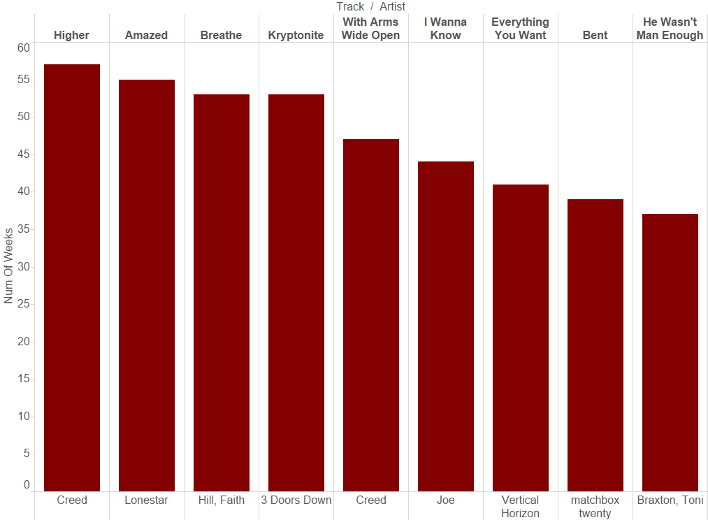
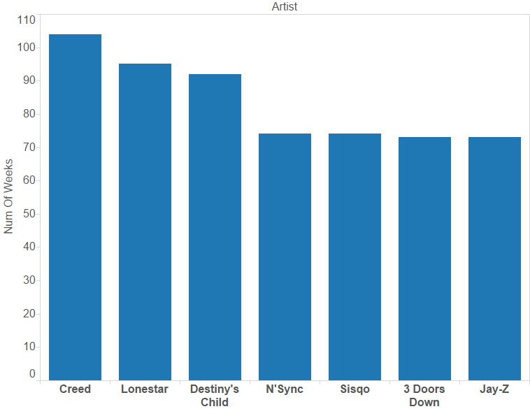
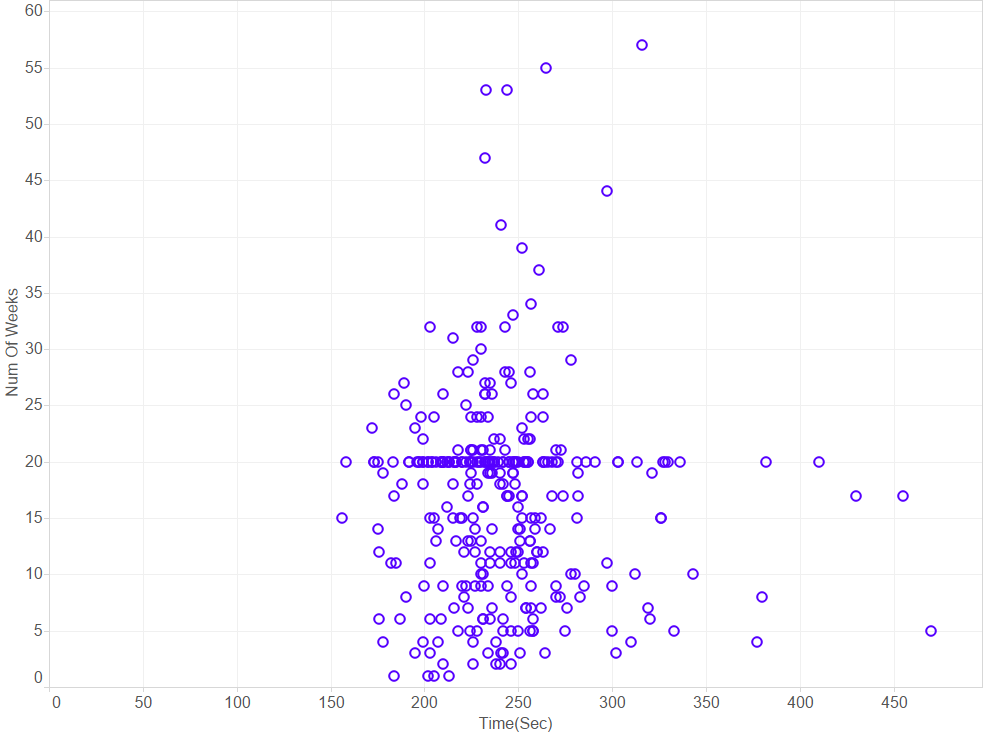
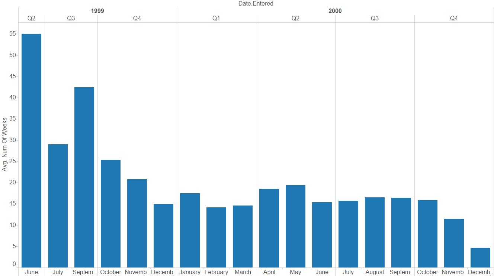
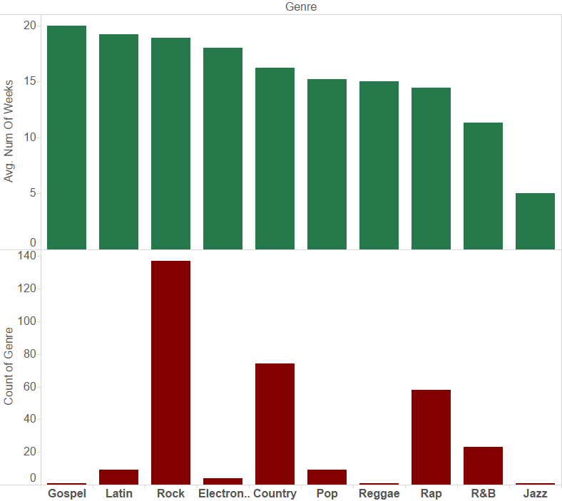
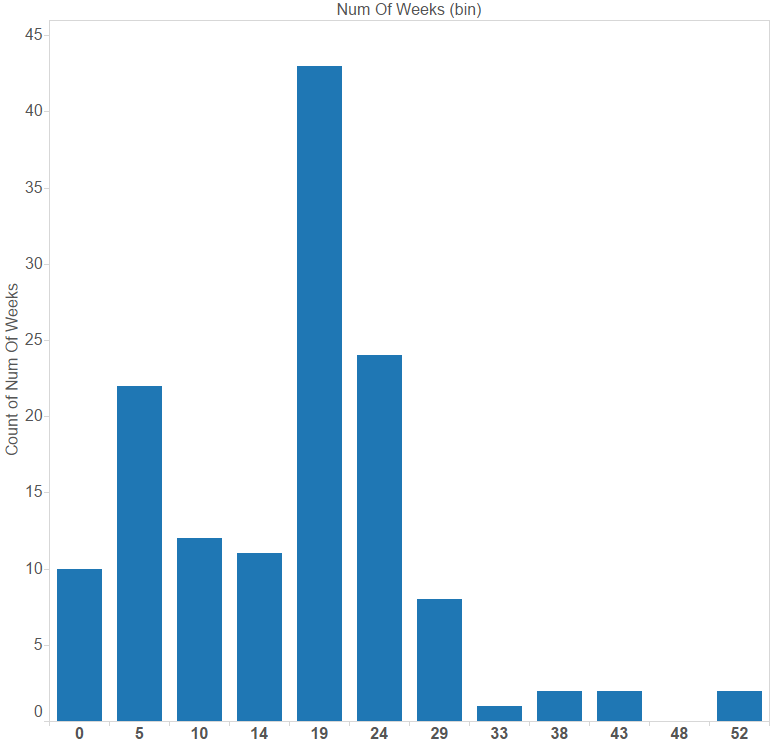
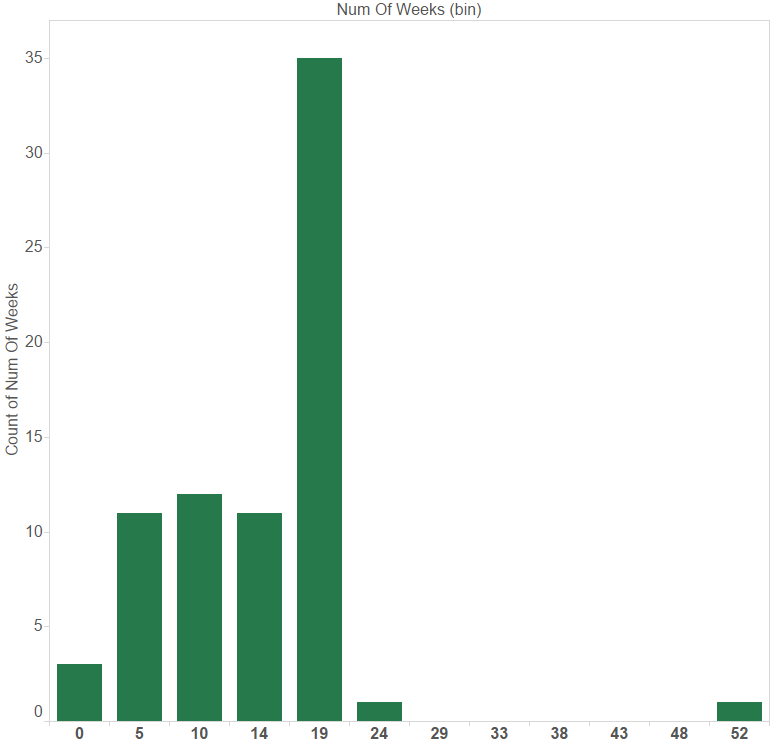
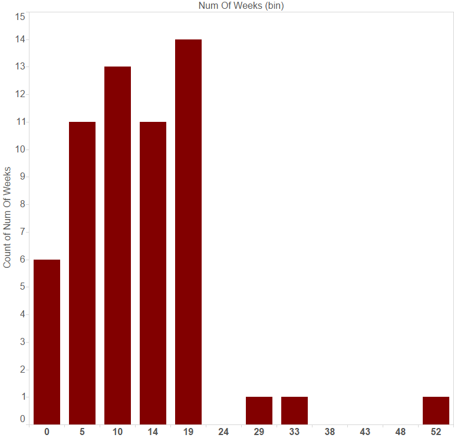

# KV Project 2: Exploring the billboard Top 100, circa 2000
## Step 1: Data exploration


```python
# Load libraries

import numpy as np
import pandas as pd
import matplotlib.pyplot as plt
import seaborn as sns
from numpy import random
import datetime
import scipy.stats as stats
%matplotlib inline
```


```python
# Load data into pandas

bb_100 = pd.read_csv("billboard.csv", encoding = "cp1252")
print(bb_100.shape)
```

    (317, 83)
    


```python
# Explore data

bb_100.head(15)
```


<div>
<table border="1" class="dataframe">
  <thead>
    <tr style="text-align: right;">
      <th></th>
      <th>year</th>
      <th>artist.inverted</th>
      <th>track</th>
      <th>time</th>
      <th>genre</th>
      <th>date.entered</th>
      <th>date.peaked</th>
      <th>x1st.week</th>
      <th>x2nd.week</th>
      <th>x3rd.week</th>
      <th>...</th>
      <th>x67th.week</th>
      <th>x68th.week</th>
      <th>x69th.week</th>
      <th>x70th.week</th>
      <th>x71st.week</th>
      <th>x72nd.week</th>
      <th>x73rd.week</th>
      <th>x74th.week</th>
      <th>x75th.week</th>
      <th>x76th.week</th>
    </tr>
  </thead>
  <tbody>
    <tr>
      <th>0</th>
      <td>2000</td>
      <td>Destiny's Child</td>
      <td>Independent Women Part I</td>
      <td>3:38</td>
      <td>Rock</td>
      <td>2000-09-23</td>
      <td>2000-11-18</td>
      <td>78</td>
      <td>63.0</td>
      <td>49.0</td>
      <td>...</td>
      <td>NaN</td>
      <td>NaN</td>
      <td>NaN</td>
      <td>NaN</td>
      <td>NaN</td>
      <td>NaN</td>
      <td>NaN</td>
      <td>NaN</td>
      <td>NaN</td>
      <td>NaN</td>
    </tr>
    <tr>
      <th>1</th>
      <td>2000</td>
      <td>Santana</td>
      <td>Maria, Maria</td>
      <td>4:18</td>
      <td>Rock</td>
      <td>2000-02-12</td>
      <td>2000-04-08</td>
      <td>15</td>
      <td>8.0</td>
      <td>6.0</td>
      <td>...</td>
      <td>NaN</td>
      <td>NaN</td>
      <td>NaN</td>
      <td>NaN</td>
      <td>NaN</td>
      <td>NaN</td>
      <td>NaN</td>
      <td>NaN</td>
      <td>NaN</td>
      <td>NaN</td>
    </tr>
    <tr>
      <th>2</th>
      <td>2000</td>
      <td>Savage Garden</td>
      <td>I Knew I Loved You</td>
      <td>4:07</td>
      <td>Rock</td>
      <td>1999-10-23</td>
      <td>2000-01-29</td>
      <td>71</td>
      <td>48.0</td>
      <td>43.0</td>
      <td>...</td>
      <td>NaN</td>
      <td>NaN</td>
      <td>NaN</td>
      <td>NaN</td>
      <td>NaN</td>
      <td>NaN</td>
      <td>NaN</td>
      <td>NaN</td>
      <td>NaN</td>
      <td>NaN</td>
    </tr>
    <tr>
      <th>3</th>
      <td>2000</td>
      <td>Madonna</td>
      <td>Music</td>
      <td>3:45</td>
      <td>Rock</td>
      <td>2000-08-12</td>
      <td>2000-09-16</td>
      <td>41</td>
      <td>23.0</td>
      <td>18.0</td>
      <td>...</td>
      <td>NaN</td>
      <td>NaN</td>
      <td>NaN</td>
      <td>NaN</td>
      <td>NaN</td>
      <td>NaN</td>
      <td>NaN</td>
      <td>NaN</td>
      <td>NaN</td>
      <td>NaN</td>
    </tr>
    <tr>
      <th>4</th>
      <td>2000</td>
      <td>Aguilera, Christina</td>
      <td>Come On Over Baby (All I Want Is You)</td>
      <td>3:38</td>
      <td>Rock</td>
      <td>2000-08-05</td>
      <td>2000-10-14</td>
      <td>57</td>
      <td>47.0</td>
      <td>45.0</td>
      <td>...</td>
      <td>NaN</td>
      <td>NaN</td>
      <td>NaN</td>
      <td>NaN</td>
      <td>NaN</td>
      <td>NaN</td>
      <td>NaN</td>
      <td>NaN</td>
      <td>NaN</td>
      <td>NaN</td>
    </tr>
    <tr>
      <th>5</th>
      <td>2000</td>
      <td>Janet</td>
      <td>Doesn't Really Matter</td>
      <td>4:17</td>
      <td>Rock</td>
      <td>2000-06-17</td>
      <td>2000-08-26</td>
      <td>59</td>
      <td>52.0</td>
      <td>43.0</td>
      <td>...</td>
      <td>NaN</td>
      <td>NaN</td>
      <td>NaN</td>
      <td>NaN</td>
      <td>NaN</td>
      <td>NaN</td>
      <td>NaN</td>
      <td>NaN</td>
      <td>NaN</td>
      <td>NaN</td>
    </tr>
    <tr>
      <th>6</th>
      <td>2000</td>
      <td>Destiny's Child</td>
      <td>Say My Name</td>
      <td>4:31</td>
      <td>Rock</td>
      <td>1999-12-25</td>
      <td>2000-03-18</td>
      <td>83</td>
      <td>83.0</td>
      <td>44.0</td>
      <td>...</td>
      <td>NaN</td>
      <td>NaN</td>
      <td>NaN</td>
      <td>NaN</td>
      <td>NaN</td>
      <td>NaN</td>
      <td>NaN</td>
      <td>NaN</td>
      <td>NaN</td>
      <td>NaN</td>
    </tr>
    <tr>
      <th>7</th>
      <td>2000</td>
      <td>Iglesias, Enrique</td>
      <td>Be With You</td>
      <td>3:36</td>
      <td>Latin</td>
      <td>2000-04-01</td>
      <td>2000-06-24</td>
      <td>63</td>
      <td>45.0</td>
      <td>34.0</td>
      <td>...</td>
      <td>NaN</td>
      <td>NaN</td>
      <td>NaN</td>
      <td>NaN</td>
      <td>NaN</td>
      <td>NaN</td>
      <td>NaN</td>
      <td>NaN</td>
      <td>NaN</td>
      <td>NaN</td>
    </tr>
    <tr>
      <th>8</th>
      <td>2000</td>
      <td>Sisqo</td>
      <td>Incomplete</td>
      <td>3:52</td>
      <td>Rock</td>
      <td>2000-06-24</td>
      <td>2000-08-12</td>
      <td>77</td>
      <td>66.0</td>
      <td>61.0</td>
      <td>...</td>
      <td>NaN</td>
      <td>NaN</td>
      <td>NaN</td>
      <td>NaN</td>
      <td>NaN</td>
      <td>NaN</td>
      <td>NaN</td>
      <td>NaN</td>
      <td>NaN</td>
      <td>NaN</td>
    </tr>
    <tr>
      <th>9</th>
      <td>2000</td>
      <td>Lonestar</td>
      <td>Amazed</td>
      <td>4:25</td>
      <td>Country</td>
      <td>1999-06-05</td>
      <td>2000-03-04</td>
      <td>81</td>
      <td>54.0</td>
      <td>44.0</td>
      <td>...</td>
      <td>NaN</td>
      <td>NaN</td>
      <td>NaN</td>
      <td>NaN</td>
      <td>NaN</td>
      <td>NaN</td>
      <td>NaN</td>
      <td>NaN</td>
      <td>NaN</td>
      <td>NaN</td>
    </tr>
    <tr>
      <th>10</th>
      <td>2000</td>
      <td>N'Sync</td>
      <td>It's Gonna Be Me</td>
      <td>3:10</td>
      <td>Rock</td>
      <td>2000-05-06</td>
      <td>2000-07-29</td>
      <td>82</td>
      <td>70.0</td>
      <td>51.0</td>
      <td>...</td>
      <td>NaN</td>
      <td>NaN</td>
      <td>NaN</td>
      <td>NaN</td>
      <td>NaN</td>
      <td>NaN</td>
      <td>NaN</td>
      <td>NaN</td>
      <td>NaN</td>
      <td>NaN</td>
    </tr>
    <tr>
      <th>11</th>
      <td>2000</td>
      <td>Aguilera, Christina</td>
      <td>What A Girl Wants</td>
      <td>3:18</td>
      <td>Rock</td>
      <td>1999-11-27</td>
      <td>2000-01-15</td>
      <td>71</td>
      <td>51.0</td>
      <td>28.0</td>
      <td>...</td>
      <td>NaN</td>
      <td>NaN</td>
      <td>NaN</td>
      <td>NaN</td>
      <td>NaN</td>
      <td>NaN</td>
      <td>NaN</td>
      <td>NaN</td>
      <td>NaN</td>
      <td>NaN</td>
    </tr>
    <tr>
      <th>12</th>
      <td>2000</td>
      <td>Vertical Horizon</td>
      <td>Everything You Want</td>
      <td>4:01</td>
      <td>Rock</td>
      <td>2000-01-22</td>
      <td>2000-07-15</td>
      <td>70</td>
      <td>61.0</td>
      <td>53.0</td>
      <td>...</td>
      <td>NaN</td>
      <td>NaN</td>
      <td>NaN</td>
      <td>NaN</td>
      <td>NaN</td>
      <td>NaN</td>
      <td>NaN</td>
      <td>NaN</td>
      <td>NaN</td>
      <td>NaN</td>
    </tr>
    <tr>
      <th>13</th>
      <td>2000</td>
      <td>Creed</td>
      <td>With Arms Wide Open</td>
      <td>3:52</td>
      <td>Rock</td>
      <td>2000-05-13</td>
      <td>2000-11-11</td>
      <td>84</td>
      <td>78.0</td>
      <td>76.0</td>
      <td>...</td>
      <td>NaN</td>
      <td>NaN</td>
      <td>NaN</td>
      <td>NaN</td>
      <td>NaN</td>
      <td>NaN</td>
      <td>NaN</td>
      <td>NaN</td>
      <td>NaN</td>
      <td>NaN</td>
    </tr>
    <tr>
      <th>14</th>
      <td>2000</td>
      <td>Aaliyah</td>
      <td>Try Again</td>
      <td>4:03</td>
      <td>Rock</td>
      <td>2000-03-18</td>
      <td>2000-06-17</td>
      <td>59</td>
      <td>53.0</td>
      <td>38.0</td>
      <td>...</td>
      <td>NaN</td>
      <td>NaN</td>
      <td>NaN</td>
      <td>NaN</td>
      <td>NaN</td>
      <td>NaN</td>
      <td>NaN</td>
      <td>NaN</td>
      <td>NaN</td>
      <td>NaN</td>
    </tr>
  </tbody>
</table>
<p>15 rows × 83 columns</p>
</div>


##### Write a brief description of your data, and any interesting observations you've made thus far. 

The dataset contains 317 tracks/singles that made it to the billboard top 100 AROUND the year 2000, along with the artist name, track length and genre. The billboard top 100 provides weekly rankings of singles based on the amount of radio play, online streaming, and physical and digital sales (source: Wikipedia). Given that the data is from circa 2000, one can assume that radio play and physical sales contributed predominantly to the rankings. 

The dataset also includes the dates that a track entered and peaked in the top 100, as well as its position/rank every week for 76 weeks, starting the week that it made it to the top 100.

Here are a couple of observations thus far:

(1) There seem to be a predominance of Rock tracks in the top 100

(2) Tracks seem to have entered the top 100 prior to the first week of Dec 1999, which is the official start of the 2000 chart "year" (Dec 99 1st wk - Nov 00 last wk)  

## Step 2: Data cleaning

##### 2.1: Rename columns


```python
# Rename artist.inverted, time 
bb_100 = bb_100.rename(columns = {'artist.inverted':'artist'})

# Rename weeks columns 
col_list = bb_100.columns
# Get only the weeks columns
col_list_weeks = col_list[7:] 
col_list_new = []
# Create a list of new column names
[col_list_new.append(str(i)) for i in range(1,77)]
new_col_dict = dict(zip(col_list_weeks, col_list_new))
# Rename using the original list and new list of column names
bb_100 = bb_100.rename(columns = new_col_dict)

bb_100.head()
```


<div>
<table border="1" class="dataframe">
  <thead>
    <tr style="text-align: right;">
      <th></th>
      <th>year</th>
      <th>artist</th>
      <th>track</th>
      <th>time</th>
      <th>genre</th>
      <th>date.entered</th>
      <th>date.peaked</th>
      <th>1</th>
      <th>2</th>
      <th>3</th>
      <th>...</th>
      <th>67</th>
      <th>68</th>
      <th>69</th>
      <th>70</th>
      <th>71</th>
      <th>72</th>
      <th>73</th>
      <th>74</th>
      <th>75</th>
      <th>76</th>
    </tr>
  </thead>
  <tbody>
    <tr>
      <th>0</th>
      <td>2000</td>
      <td>Destiny's Child</td>
      <td>Independent Women Part I</td>
      <td>3:38</td>
      <td>Rock</td>
      <td>2000-09-23</td>
      <td>2000-11-18</td>
      <td>78</td>
      <td>63.0</td>
      <td>49.0</td>
      <td>...</td>
      <td>NaN</td>
      <td>NaN</td>
      <td>NaN</td>
      <td>NaN</td>
      <td>NaN</td>
      <td>NaN</td>
      <td>NaN</td>
      <td>NaN</td>
      <td>NaN</td>
      <td>NaN</td>
    </tr>
    <tr>
      <th>1</th>
      <td>2000</td>
      <td>Santana</td>
      <td>Maria, Maria</td>
      <td>4:18</td>
      <td>Rock</td>
      <td>2000-02-12</td>
      <td>2000-04-08</td>
      <td>15</td>
      <td>8.0</td>
      <td>6.0</td>
      <td>...</td>
      <td>NaN</td>
      <td>NaN</td>
      <td>NaN</td>
      <td>NaN</td>
      <td>NaN</td>
      <td>NaN</td>
      <td>NaN</td>
      <td>NaN</td>
      <td>NaN</td>
      <td>NaN</td>
    </tr>
    <tr>
      <th>2</th>
      <td>2000</td>
      <td>Savage Garden</td>
      <td>I Knew I Loved You</td>
      <td>4:07</td>
      <td>Rock</td>
      <td>1999-10-23</td>
      <td>2000-01-29</td>
      <td>71</td>
      <td>48.0</td>
      <td>43.0</td>
      <td>...</td>
      <td>NaN</td>
      <td>NaN</td>
      <td>NaN</td>
      <td>NaN</td>
      <td>NaN</td>
      <td>NaN</td>
      <td>NaN</td>
      <td>NaN</td>
      <td>NaN</td>
      <td>NaN</td>
    </tr>
    <tr>
      <th>3</th>
      <td>2000</td>
      <td>Madonna</td>
      <td>Music</td>
      <td>3:45</td>
      <td>Rock</td>
      <td>2000-08-12</td>
      <td>2000-09-16</td>
      <td>41</td>
      <td>23.0</td>
      <td>18.0</td>
      <td>...</td>
      <td>NaN</td>
      <td>NaN</td>
      <td>NaN</td>
      <td>NaN</td>
      <td>NaN</td>
      <td>NaN</td>
      <td>NaN</td>
      <td>NaN</td>
      <td>NaN</td>
      <td>NaN</td>
    </tr>
    <tr>
      <th>4</th>
      <td>2000</td>
      <td>Aguilera, Christina</td>
      <td>Come On Over Baby (All I Want Is You)</td>
      <td>3:38</td>
      <td>Rock</td>
      <td>2000-08-05</td>
      <td>2000-10-14</td>
      <td>57</td>
      <td>47.0</td>
      <td>45.0</td>
      <td>...</td>
      <td>NaN</td>
      <td>NaN</td>
      <td>NaN</td>
      <td>NaN</td>
      <td>NaN</td>
      <td>NaN</td>
      <td>NaN</td>
      <td>NaN</td>
      <td>NaN</td>
      <td>NaN</td>
    </tr>
  </tbody>
</table>
<p>5 rows × 83 columns</p>
</div>


##### 2.2: Date and time manipulations


```python
# Check data types
bb_100.dtypes;
```


```python
# Calculate time in seconds, and add to table
temp_time = bb_100["time"].str.split(":")
length = len(temp_time)
sec_list = []
[sec_list.append(int(temp_time[i][0])*60 + int(temp_time[i][1])) for i in range(length)]
bb_100["time(sec)"] = sec_list

# Change data type for date.entered and date.peaked
bb_100["date.entered"] = bb_100["date.entered"].astype("datetime64")
bb_100["date.peaked"] = bb_100["date.peaked"].astype("datetime64")

# Calculate time to peak in days
bb_100["Time_to_peak (days)"] = (bb_100["date.peaked"] - bb_100["date.entered"]).astype('timedelta64[D]')

bb_100.dtypes;
```

##### 2.3: Calculate number of weeks and average ranking


```python
# Find out the number of weeks each track has been on the billboard, and average rating for each track
col_list = bb_100.columns
col_list = col_list[7:-2]
data_weeks = bb_100[col_list]

# Add these quantities to the dataframe
bb_100["num_of_weeks"] = data_weeks.count(axis=1)
bb_100["av_ranking"] = data_weeks.mean(axis=1)

bb_100.head()
```


<div>
<table border="1" class="dataframe">
  <thead>
    <tr style="text-align: right;">
      <th></th>
      <th>year</th>
      <th>artist</th>
      <th>track</th>
      <th>time</th>
      <th>genre</th>
      <th>date.entered</th>
      <th>date.peaked</th>
      <th>1</th>
      <th>2</th>
      <th>3</th>
      <th>...</th>
      <th>71</th>
      <th>72</th>
      <th>73</th>
      <th>74</th>
      <th>75</th>
      <th>76</th>
      <th>time(sec)</th>
      <th>Time_to_peak (days)</th>
      <th>num_of_weeks</th>
      <th>av_ranking</th>
    </tr>
  </thead>
  <tbody>
    <tr>
      <th>0</th>
      <td>2000</td>
      <td>Destiny's Child</td>
      <td>Independent Women Part I</td>
      <td>3:38</td>
      <td>Rock</td>
      <td>2000-09-23</td>
      <td>2000-11-18</td>
      <td>78</td>
      <td>63.0</td>
      <td>49.0</td>
      <td>...</td>
      <td>NaN</td>
      <td>NaN</td>
      <td>NaN</td>
      <td>NaN</td>
      <td>NaN</td>
      <td>NaN</td>
      <td>218</td>
      <td>56.0</td>
      <td>28</td>
      <td>14.821429</td>
    </tr>
    <tr>
      <th>1</th>
      <td>2000</td>
      <td>Santana</td>
      <td>Maria, Maria</td>
      <td>4:18</td>
      <td>Rock</td>
      <td>2000-02-12</td>
      <td>2000-04-08</td>
      <td>15</td>
      <td>8.0</td>
      <td>6.0</td>
      <td>...</td>
      <td>NaN</td>
      <td>NaN</td>
      <td>NaN</td>
      <td>NaN</td>
      <td>NaN</td>
      <td>NaN</td>
      <td>258</td>
      <td>56.0</td>
      <td>26</td>
      <td>10.500000</td>
    </tr>
    <tr>
      <th>2</th>
      <td>2000</td>
      <td>Savage Garden</td>
      <td>I Knew I Loved You</td>
      <td>4:07</td>
      <td>Rock</td>
      <td>1999-10-23</td>
      <td>2000-01-29</td>
      <td>71</td>
      <td>48.0</td>
      <td>43.0</td>
      <td>...</td>
      <td>NaN</td>
      <td>NaN</td>
      <td>NaN</td>
      <td>NaN</td>
      <td>NaN</td>
      <td>NaN</td>
      <td>247</td>
      <td>98.0</td>
      <td>33</td>
      <td>17.363636</td>
    </tr>
    <tr>
      <th>3</th>
      <td>2000</td>
      <td>Madonna</td>
      <td>Music</td>
      <td>3:45</td>
      <td>Rock</td>
      <td>2000-08-12</td>
      <td>2000-09-16</td>
      <td>41</td>
      <td>23.0</td>
      <td>18.0</td>
      <td>...</td>
      <td>NaN</td>
      <td>NaN</td>
      <td>NaN</td>
      <td>NaN</td>
      <td>NaN</td>
      <td>NaN</td>
      <td>225</td>
      <td>35.0</td>
      <td>24</td>
      <td>13.458333</td>
    </tr>
    <tr>
      <th>4</th>
      <td>2000</td>
      <td>Aguilera, Christina</td>
      <td>Come On Over Baby (All I Want Is You)</td>
      <td>3:38</td>
      <td>Rock</td>
      <td>2000-08-05</td>
      <td>2000-10-14</td>
      <td>57</td>
      <td>47.0</td>
      <td>45.0</td>
      <td>...</td>
      <td>NaN</td>
      <td>NaN</td>
      <td>NaN</td>
      <td>NaN</td>
      <td>NaN</td>
      <td>NaN</td>
      <td>218</td>
      <td>70.0</td>
      <td>21</td>
      <td>19.952381</td>
    </tr>
  </tbody>
</table>
<p>5 rows × 87 columns</p>
</div>


##### Using Pandas' built in `melt` function, pivot the weekly ranking data to be long rather than wide. As a result, you will have removed the 72 'week' columns and replace it with two: Week and Ranking. There will now be multiple entries for each song, one for each week on the Billboard rankings.


```python
# Replace 

bb_100_cleaned = pd.melt(bb_100, id_vars = ["year", "artist", "track", "time", "genre", 
                                 "date.entered", "date.peaked", "time(sec)", "Time_to_peak (days)", 
                                 "num_of_weeks", "av_ranking"], 
              var_name = "Week", value_name = "Ranking")

bb_100_cleaned.head()
```


<div>
<table border="1" class="dataframe">
  <thead>
    <tr style="text-align: right;">
      <th></th>
      <th>year</th>
      <th>artist</th>
      <th>track</th>
      <th>time</th>
      <th>genre</th>
      <th>date.entered</th>
      <th>date.peaked</th>
      <th>time(sec)</th>
      <th>Time_to_peak (days)</th>
      <th>num_of_weeks</th>
      <th>av_ranking</th>
      <th>Week</th>
      <th>Ranking</th>
    </tr>
  </thead>
  <tbody>
    <tr>
      <th>0</th>
      <td>2000</td>
      <td>Destiny's Child</td>
      <td>Independent Women Part I</td>
      <td>3:38</td>
      <td>Rock</td>
      <td>2000-09-23</td>
      <td>2000-11-18</td>
      <td>218</td>
      <td>56.0</td>
      <td>28</td>
      <td>14.821429</td>
      <td>1</td>
      <td>78.0</td>
    </tr>
    <tr>
      <th>1</th>
      <td>2000</td>
      <td>Santana</td>
      <td>Maria, Maria</td>
      <td>4:18</td>
      <td>Rock</td>
      <td>2000-02-12</td>
      <td>2000-04-08</td>
      <td>258</td>
      <td>56.0</td>
      <td>26</td>
      <td>10.500000</td>
      <td>1</td>
      <td>15.0</td>
    </tr>
    <tr>
      <th>2</th>
      <td>2000</td>
      <td>Savage Garden</td>
      <td>I Knew I Loved You</td>
      <td>4:07</td>
      <td>Rock</td>
      <td>1999-10-23</td>
      <td>2000-01-29</td>
      <td>247</td>
      <td>98.0</td>
      <td>33</td>
      <td>17.363636</td>
      <td>1</td>
      <td>71.0</td>
    </tr>
    <tr>
      <th>3</th>
      <td>2000</td>
      <td>Madonna</td>
      <td>Music</td>
      <td>3:45</td>
      <td>Rock</td>
      <td>2000-08-12</td>
      <td>2000-09-16</td>
      <td>225</td>
      <td>35.0</td>
      <td>24</td>
      <td>13.458333</td>
      <td>1</td>
      <td>41.0</td>
    </tr>
    <tr>
      <th>4</th>
      <td>2000</td>
      <td>Aguilera, Christina</td>
      <td>Come On Over Baby (All I Want Is You)</td>
      <td>3:38</td>
      <td>Rock</td>
      <td>2000-08-05</td>
      <td>2000-10-14</td>
      <td>218</td>
      <td>70.0</td>
      <td>21</td>
      <td>19.952381</td>
      <td>1</td>
      <td>57.0</td>
    </tr>
  </tbody>
</table>
</div>


## Step 3: Data visualization


```python
# Export dataframe to csv file to facilitate visualization in Tableau

bb_100.to_csv("bb_100_cleaned1.csv")
```

There are 2 categories of questions that can be visualized using graphs on the cleaned data:

1) Which track and which artist spent the most time in the top 100?

2) What factors correlate to number of weeks spent in the top 100?

##### 3.1 Who and what in the top 100?

#### Higher, by Creed, spent the most time (57 weeks) in the top 100

#### Creed's tracks spent the most time in total (104 weeks) in the top 100


##### 3.2 Does anything correlate with number of weeks spent in top 100?

#### There is no correlation between track length and number of weeks

#### While tracks that entered in Q2 and Q3 of 1999 seem to have stayed longer in the top 100, very few tracks [less than 5 out of 317 total] entered the billboard during that period. More data [>30 tracks] from that time period would be helpful to further evaluate this hypothesis.

#### Average time spent in the top 100 seems to be genre dependent, but most genres did not have enough tracks (samples). It may be interesting to explore whether average number of weeks for Rock is siginificantly different than Country or Rap


## Step 4: Problem Statement


#### Determine whether the average time spent by a Rock track in the top 100 is significantly different than the average time spent by a Country track or a Rap track.

## Step 5: Approach


1) Plot the distribution of number of weeks for Rock, Country and Rap separately

2) If they are not normally distributed, **ASSUME** that the number of weeks for each is a random, independent variable, whose mean will be normal or nearly normal per the Central Limit theorem (number of samples > 50 for each, in this case). 

3) Create arrays for number of weeks for each genre of interest. Check if sample variances are similar or different

4) Use scipy.stats to determine p-values for each pairwise comparison. Use Welch's t-test instead of the Student's t-test if sample variances are very different

5) Use a significance level of 0.05 to determine whether to reject, or fail to reject the null hypothesis

##### 5.1 and 5.2: Plot distributions. See if they are normally distributed


#### None of the distributions is normal. All of them are skewed positive. Assume means are normally distributed since sample size is >50
#### Rock

#### Country

#### Rap


##### 5.3: Create arrays of number of weeks for Rock, Country and Rap


```python
rock = bb_100[bb_100["genre"] == "Rock"]["num_of_weeks"]
country = bb_100[bb_100["genre"] == "Country"]["num_of_weeks"]
rap = bb_100[bb_100["genre"] == "Rap"]["num_of_weeks"]
print("Variances - Rock: {}, Country: {}, Rap: {}".format(np.var(rock), np.var(country), np.var(rap)))
```

    Variances - Rock: 103.18344078000965, Country: 52.14243973703431, Rap: 75.48662306777649
    

##### 5.4: Run Welch's t-test on each pair


```python
t_rock_country = stats.ttest_ind(rock, country, equal_var=False, nan_policy='omit')
t_rock_rap = stats.ttest_ind(rock, rap, equal_var=False, nan_policy='omit')
t_country_rap = stats.ttest_ind(country, rap, equal_var=False, nan_policy='omit')
```

##### 5.5: Evaluate p-values to draw conclusions


```python
print("P-values ... Rock-Country: {}, Rock-Rap: {}, Country-Rap: {}".
      format(t_rock_country[1], t_rock_rap[1], t_country_rap[1]))
```

    P-values ... Rock-Country: 0.029174606128373227, Rock-Rap: 0.002512230707036884, Country-Rap: 0.21384007424877874
    

### Conclusions 

### Rock tracks spent higher time in the top 100 on average (18.9 weeks) than Country tracks (16.2 weeks) or Rap tracks (14.4 weeks), circa 2000. Country tracks and Rap tracks spent the same amount of time in the top 100. It would be interesting to see if this trend holds true for other years. It would also be interesting to see if the billboard Top 100 is biased towards Rock tracks (radio stations playing more Rock to cater to certain audiences, for example), resulting in these trends.

## Step 6: Blog Post

## https://karthik-33.github.io/billboard/
